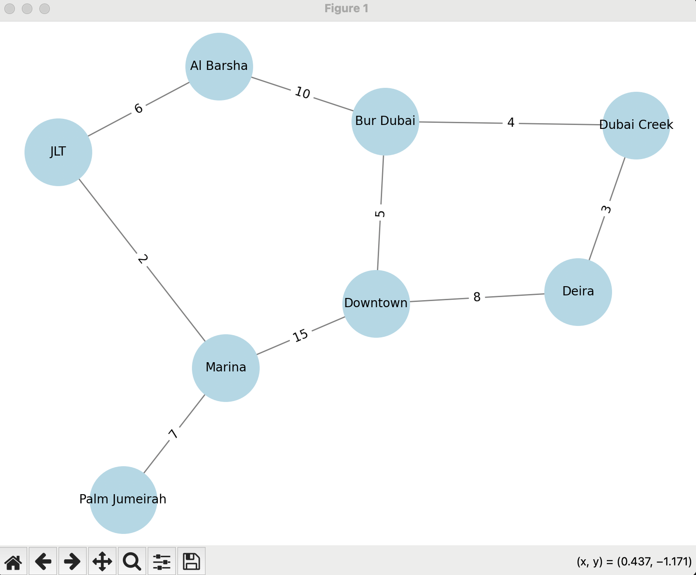

# goit-algo-hw-06
## Завдання 1

Створіть граф за допомогою бібліотеки networkX для моделювання певної реальної мережі (транспортної мережі міста Дубай).

Візуалізуйте створений граф, проведіть аналіз основних характеристик (наприклад, кількість вершин та ребер, ступінь вершин).

**Для запуску скрипту у терміналі:**
```
python task_1.py

Кількість вершин: 8
Кількість ребер: 9
Ступінь вершин:
      Вершина  Ступінь вершини
     Downtown                3
        Deira                2
       Marina                3
    Bur Dubai                3
    Al Barsha                2
          JLT                2
Palm Jumeirah                1
  Dubai Creek                2
```

Граф — модель транспортної мережі міста Дубай:



## Завдання 2

Напишіть програму, яка використовує алгоритми DFS і BFS для знаходження шляхів у графі, який було розроблено у першому завданні.

Далі порівняйте результати виконання обох алгоритмів для цього графа, висвітлить різницю в отриманих шляхах. Поясніть, чому шляхи для алгоритмів саме такі.

**Для запуску скрипту у терміналі:**
```
python task_2.py
Кількість вершин: 8
Кількість ребер: 9
Ступінь вершин:
      Вершина  Ступінь вершини
     Downtown                3
        Deira                2
       Marina                3
    Bur Dubai                3
    Al Barsha                2
          JLT                2
Palm Jumeirah                1
  Dubai Creek                2
Шлях між Downtown та Palm Jumeirah
DFS Path: ['Downtown', 'Deira', 'Dubai Creek', 'Bur Dubai', 'Al Barsha', 'JLT', 'Marina', 'Palm Jumeirah']
BFS Path: ['Downtown', 'Marina', 'Palm Jumeirah']
```

### Результати виконання алгоритмів:
DFS (Пошук у глибину) знайшов шлях:
**Downtown → Deira → Dubai Creek → Bur Dubai → Al Barsha → JLT → Marina → Palm Jumeirah**

BFS (Пошук у ширину) знайшов шлях:
**Downtown → Marina → Palm Jumeirah**

### Аналіз та пояснення:
**DFS (глибина в першу чергу)**

DFS рухається вглиб першого доступного маршруту, поки не досягне цілі або не упреться у глухий кут.
В даному випадку, він спочатку пішов через Deira, Dubai Creek, Bur Dubai, а потім через інші станції до Palm Jumeirah.
DFS не гарантує найкоротший шлях, але може знайти рішення швидше в залежності від порядку обходу вершин.

**BFS (ширина в першу чергу)**

BFS шукає найкоротший шлях у сенсі кількості ребер, розширюючи всі сусідні вузли рівномірно.
У цьому випадку, BFS знайшов найкоротший маршрут Downtown → Marina → Palm Jumeirah, який має лише 2 ребра, на відміну від DFS, який знайшов довший шлях.

### Висновки:
**BFS зазвичай знаходить найкоротший шлях у незважених графах** (оскільки перевіряє всі можливі варіанти рівномірно)

**DFS може знайти шлях швидко, але він не завжди найкоротший** (бо алгоритм прямує глибше у випадковому порядку)


## Завдання 3

Реалізуйте алгоритм Дейкстри для знаходження найкоротшого шляху в розробленому графі: додайте у граф ваги до ребер та знайдіть найкоротший шлях між всіма вершинами графа.

**Для запуску скрипту у терміналі:**
```
python task_3.py

Кількість вершин: 8
Кількість ребер: 9
Ступінь вершин:
      Вершина  Ступінь вершини
     Downtown                3
        Deira                2
       Marina                3
    Bur Dubai                3
    Al Barsha                2
          JLT                2
Palm Jumeirah                1
  Dubai Creek                2
Шлях між Downtown та Palm Jumeirah
DFS Path: ['Downtown', 'Deira', 'Dubai Creek', 'Bur Dubai', 'Al Barsha', 'JLT', 'Marina', 'Palm Jumeirah']
BFS Path: ['Downtown', 'Marina', 'Palm Jumeirah']
Найкоротші шляхи за алгоритмом Дейкстри:
Початкова вершина Кінцева вершина                                                   Найкоротший шлях  Відстань
         Downtown        Downtown                                                           Downtown         0
         Downtown           Deira                                                   Downtown → Deira         8
         Downtown          Marina                                                  Downtown → Marina        15
         Downtown       Bur Dubai                                               Downtown → Bur Dubai         5
         Downtown     Dubai Creek                                 Downtown → Bur Dubai → Dubai Creek         9
         Downtown       Al Barsha                                   Downtown → Bur Dubai → Al Barsha        15
         Downtown             JLT                                            Downtown → Marina → JLT        17
         Downtown   Palm Jumeirah                                  Downtown → Marina → Palm Jumeirah        22
            Deira           Deira                                                              Deira         0
            Deira        Downtown                                                   Deira → Downtown         8
            Deira     Dubai Creek                                                Deira → Dubai Creek         3
            Deira       Bur Dubai                                    Deira → Dubai Creek → Bur Dubai         7
            Deira       Al Barsha                        Deira → Dubai Creek → Bur Dubai → Al Barsha        17
            Deira          Marina                                          Deira → Downtown → Marina        23
            Deira             JLT                  Deira → Dubai Creek → Bur Dubai → Al Barsha → JLT        23
            Deira   Palm Jumeirah                          Deira → Downtown → Marina → Palm Jumeirah        30
           Marina          Marina                                                             Marina         0
           Marina        Downtown                                                  Marina → Downtown        15
           Marina             JLT                                                       Marina → JLT         2
           Marina   Palm Jumeirah                                             Marina → Palm Jumeirah         7
           Marina       Al Barsha                                           Marina → JLT → Al Barsha         8
           Marina       Bur Dubai                               Marina → JLT → Al Barsha → Bur Dubai        18
           Marina           Deira                                          Marina → Downtown → Deira        23
           Marina     Dubai Creek                 Marina → JLT → Al Barsha → Bur Dubai → Dubai Creek        22
        Bur Dubai       Bur Dubai                                                          Bur Dubai         0
        Bur Dubai        Downtown                                               Bur Dubai → Downtown         5
        Bur Dubai     Dubai Creek                                            Bur Dubai → Dubai Creek         4
        Bur Dubai       Al Barsha                                              Bur Dubai → Al Barsha        10
        Bur Dubai           Deira                                    Bur Dubai → Dubai Creek → Deira         7
        Bur Dubai          Marina                               Bur Dubai → Al Barsha → JLT → Marina        18
        Bur Dubai             JLT                                        Bur Dubai → Al Barsha → JLT        16
        Bur Dubai   Palm Jumeirah               Bur Dubai → Al Barsha → JLT → Marina → Palm Jumeirah        25
        Al Barsha       Al Barsha                                                          Al Barsha         0
        Al Barsha       Bur Dubai                                              Al Barsha → Bur Dubai        10
        Al Barsha             JLT                                                    Al Barsha → JLT         6
        Al Barsha          Marina                                           Al Barsha → JLT → Marina         8
        Al Barsha        Downtown                                   Al Barsha → Bur Dubai → Downtown        15
        Al Barsha   Palm Jumeirah                           Al Barsha → JLT → Marina → Palm Jumeirah        15
        Al Barsha     Dubai Creek                                Al Barsha → Bur Dubai → Dubai Creek        14
        Al Barsha           Deira                        Al Barsha → Bur Dubai → Dubai Creek → Deira        17
              JLT             JLT                                                                JLT         0
              JLT       Al Barsha                                                    JLT → Al Barsha         6
              JLT          Marina                                                       JLT → Marina         2
              JLT        Downtown                                            JLT → Marina → Downtown        17
              JLT   Palm Jumeirah                                       JLT → Marina → Palm Jumeirah         9
              JLT       Bur Dubai                                        JLT → Al Barsha → Bur Dubai        16
              JLT     Dubai Creek                          JLT → Al Barsha → Bur Dubai → Dubai Creek        20
              JLT           Deira                  JLT → Al Barsha → Bur Dubai → Dubai Creek → Deira        23
    Palm Jumeirah   Palm Jumeirah                                                      Palm Jumeirah         0
    Palm Jumeirah          Marina                                             Palm Jumeirah → Marina         7
    Palm Jumeirah        Downtown                                  Palm Jumeirah → Marina → Downtown        22
    Palm Jumeirah             JLT                                       Palm Jumeirah → Marina → JLT         9
    Palm Jumeirah       Al Barsha                           Palm Jumeirah → Marina → JLT → Al Barsha        15
    Palm Jumeirah       Bur Dubai               Palm Jumeirah → Marina → JLT → Al Barsha → Bur Dubai        25
    Palm Jumeirah           Deira                          Palm Jumeirah → Marina → Downtown → Deira        30
    Palm Jumeirah     Dubai Creek Palm Jumeirah → Marina → JLT → Al Barsha → Bur Dubai → Dubai Creek        29
      Dubai Creek     Dubai Creek                                                        Dubai Creek         0
      Dubai Creek           Deira                                                Dubai Creek → Deira         3
      Dubai Creek       Bur Dubai                                            Dubai Creek → Bur Dubai         4
      Dubai Creek        Downtown                                 Dubai Creek → Bur Dubai → Downtown         9
      Dubai Creek       Al Barsha                                Dubai Creek → Bur Dubai → Al Barsha        14
      Dubai Creek          Marina                 Dubai Creek → Bur Dubai → Al Barsha → JLT → Marina        22
      Dubai Creek             JLT                          Dubai Creek → Bur Dubai → Al Barsha → JLT        20
      Dubai Creek   Palm Jumeirah Dubai Creek → Bur Dubai → Al Barsha → JLT → Marina → Palm Jumeirah        29

```

Я реалізував алгоритм Дейкстри для пошуку найкоротших шляхів між усіма вершинами в транспортній мережі Дубая. У таблиці відображені найкоротші маршрути та їхні відповідні відстані.